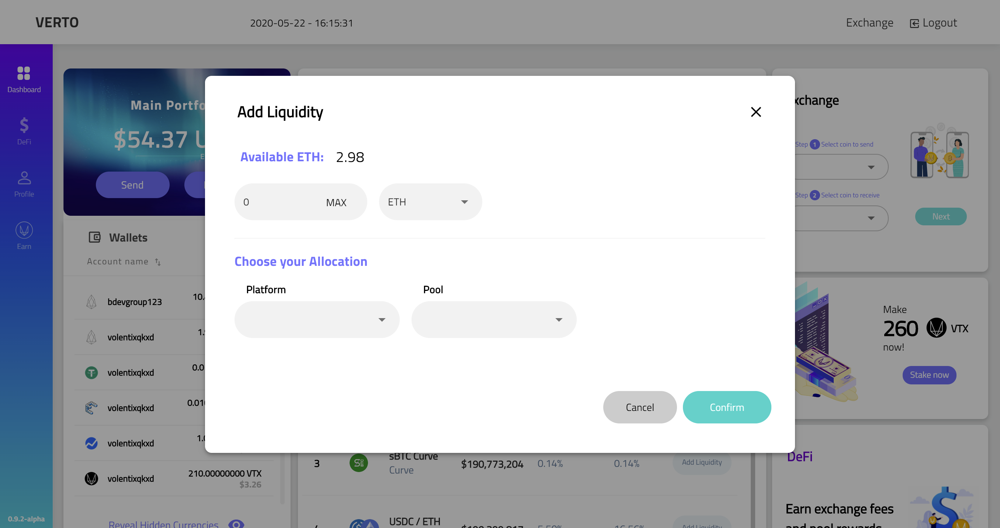

# Whats cool about Verto
  
What if we told you that bitcoiners too can participate in DeFi with Verto.  
You can use any supported coin or token to start in verto and get a Defi coin that you usually can only get into with ETH.  
Verto makes that not only possible, but easy.  

Right now, you need one of the ethereum wallets to use Ethereum tokens.  
You need an Eos wallet to use Eos tokens.  
You need a bitcoin wallet to hold your Bitcoin.   
Not practical and not anymore!  
In verto you can do it all from 1 place.   
Use your BTC, ETH or any coins/tokens to participate in any DeFi ecosystem on any chain...no need to use multiple apps and multiple websites. Verto is your crypto app.
