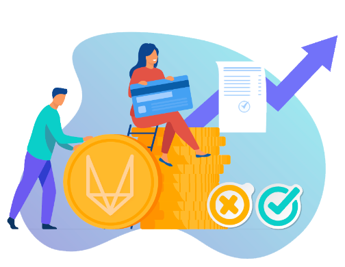

# Least cost routing with vDex

- ⚡️⚡️ What does it mean?? 
- Least cost routing means to automatically find the most cost-effective route for the specific transaction requested at that moment in time. 
- vDex aggregates liquidity pools and order books from anyone who wants to place open orders for any asset.

